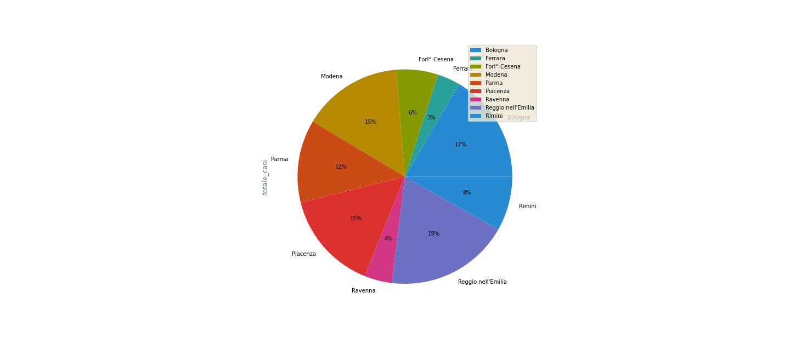

# Data Visualization


## HEADER 1

FDSFSDFDS
  1. **FDDS**
  2. 343
  3. 4454
  4. FDFR

### HEADER 2

  * FDFDS
  * FDSFS
  * FDSFDS
  * DASDAS



####  HEADER 3

FDFSDFDS FSDFDSFDS FSDFDS

> IDOSIDSODI DSIODISODIS

```
import pandas as pd
pd.
```
